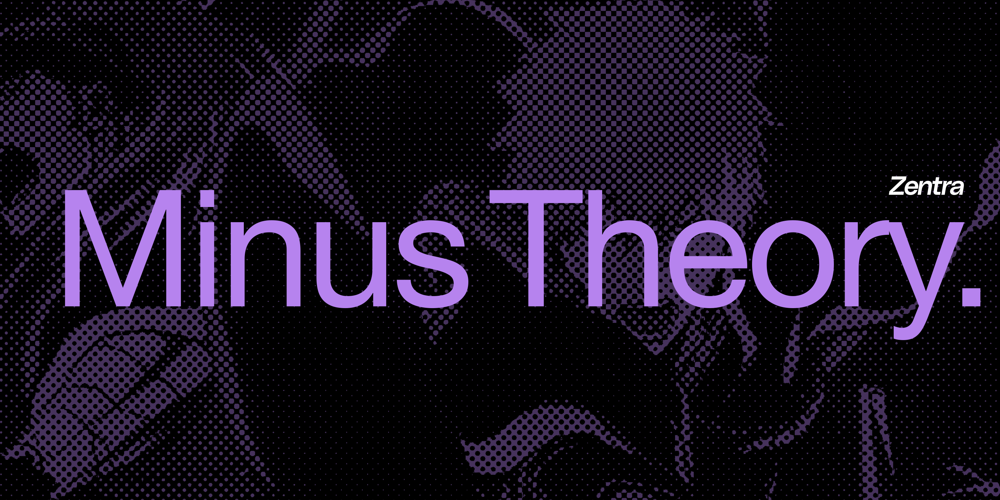

# Chain and Indexer

<figure><figcaption>
Zentra  powered by Minus Theory
</figcaption></figure>

Guided by Minus Theory, Zentra serves as the blockchain OS Layer. It works closely with blockchain nodes but is not itself a blockchain. Its core functionality can be described by the following roles:

* **Interaction with Blockchain Nodes**: Users send transactions to blockchain nodes. The order and content of these messages are finalized through the consensus mechanism of the blockchain.
* **Deterministic State Calculation**: Zentra observes the frozen messages within a block, as determined by the blockchain consensus. It then calculates deterministic state results based on these messages.

This design ensures that Zentra remains a reliable and efficient execution layer, adhering to the immutable decisions made by the underlying blockchain while enabling advanced computations and state management. As an evolving OS Layer, Zentra can switch to more decentralized or higher-performance world computers when needed, while keeping its own ability to run in a decentralized fashion.
